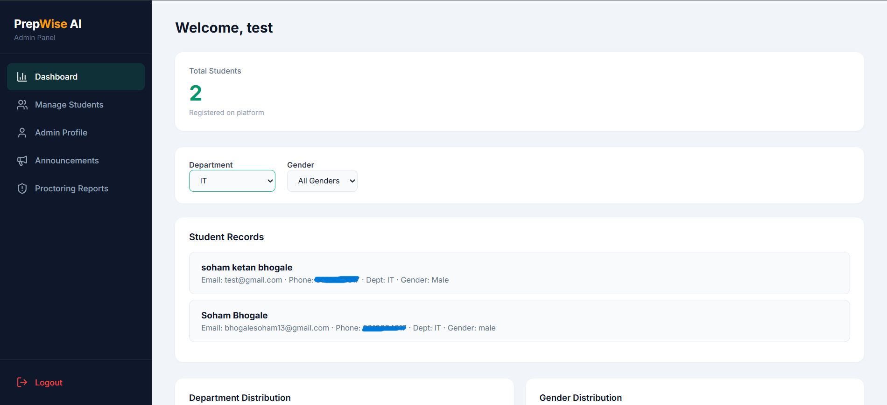

# PrepWise AI

AI-powered placement preparation platform with mock interviews, aptitude tests, DSA practice, resume builder & ATS scanner.

**Live:** https://prepwise-ai-livid.vercel.app

---

## Screenshots

### Landing Page


### Student Profile


### Admin Dashboard


### Company — Student Talent Pool


---

## Features

- **Mock Interviews** — AI-generated technical questions (Gemini) with real-time face-detection proctoring
- **Aptitude Tests** — General & technical quizzes with timed sessions and performance tracking
- **DSA Practice** — 3000+ coding problems with in-browser code execution and submission history
- **Resume Builder** — Two-template resume builder with PDF export and profile saving
- **ATS Scanner** — AI-powered resume analysis against job descriptions
- **Announcements** — Admin can broadcast messages to all students
- **Contact Form** — Students submit messages; admin can view and delete them in the dashboard
- **Multi-role System** — Separate dashboards for Students, Admins, and Companies
- **Company Portal** — Browse students, filter by CGPA/department, view resumes

---

## Tech Stack

| Layer | Technology |
|---|---|
| Frontend | HTML, CSS, JavaScript (vanilla), Lucide Icons |
| Backend | Node.js, Express |
| AI | Google Gemini API (`@google/generative-ai`) |
| Database | MongoDB Atlas |
| Auth | Google OAuth 2.0 |
| Code Execution | Python FastAPI on Render (sandboxed runner) |
| Face Detection | Python FastAPI on Render (OpenCV proctoring) |
| Deployment | Vercel (Node.js), Render (Python microservice) |

---

## Architecture

All core data operations run on the Node.js server (Vercel), eliminating cold-start delays:

- DSA problem data loaded from a bundled CSV (3315 rows, in-memory cache)
- DSA submissions and performance stats saved to MongoDB
- Gemini AI called directly from Node.js for interview question generation and evaluation
- Interview sessions, violations, and terminations stored in MongoDB

The Python microservice on Render handles only two things that require native libraries:
- `/api/dsa/execute` — sandboxed code execution
- `/api/proctor/detect` — face detection via OpenCV

---

## Project Structure

```
prepwiseAI/
├── public/              # All frontend HTML pages
│   ├── addashboard.html         # Admin: overview & charts
│   ├── admin-dashboard.html     # Admin: manage students
│   ├── admin-dashboard2.html    # Admin: announcements
│   ├── admin-contacts.html      # Admin: contact messages
│   ├── admin-proctor.html       # Admin: proctoring reports
│   └── adminprofile.html        # Admin: profile
├── data/
│   └── dsa/
│       └── question_details.csv # DSA problem dataset
├── api/                 # Python FastAPI microservice (Render)
│   ├── routes/          # code executor, proctor
│   └── services/        # OpenCV face detection
├── uploads/             # User-uploaded resumes (gitignored)
├── server.js            # Node.js/Express server (main backend)
├── vercel.json          # Vercel deployment config
└── requirements.txt     # Python dependencies
```

---

## Setup

### Prerequisites
- Node.js 18+
- Python 3.10+ (only needed for local code execution / face detection)
- MongoDB Atlas account
- Google Cloud project (OAuth + Gemini API key)

### 1. Clone & install

```bash
git clone https://github.com/anonSoham/prepwiseAI.git
cd prepwiseAI
npm install
```

### 2. Configure environment

Create a `.env` file in the root:

```env
GOOGLE_CLIENT_ID=your_google_oauth_client_id
MONGO_URI=your_mongodb_connection_string
GEMINI_API_KEY=your_gemini_api_key
GEMINI_MODEL=gemini-2.5-flash
PYTHON_API_URL=http://localhost:8000   # or your Render URL
```

### 3. Run

```bash
npm start
```

Open [http://localhost:3000](http://localhost:3000)

To also run the Python microservice locally:
```bash
pip install -r requirements.txt
uvicorn api.main:app --port 8000
```

---

## Roles & Access

| Role | Login | Default Credentials |
|---|---|---|
| Student | Google OAuth | — |
| Admin | `/admin-login.html` | Set via MongoDB |
| Company | `/company-login.html` | Set via seed script |

Seed the company account:
```bash
npm run seed
```

---

## Admin Dashboard Pages

| Page | URL |
|---|---|
| Overview & Charts | `addashboard.html` |
| Manage Students | `admin-dashboard.html` |
| Announcements | `admin-dashboard2.html` |
| Contact Messages | `admin-contacts.html` |
| Proctoring Reports | `admin-proctor.html` |
| Admin Profile | `adminprofile.html` |
